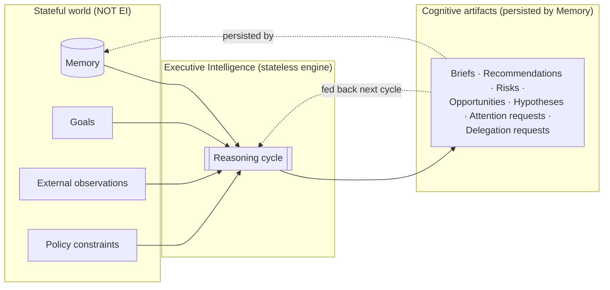
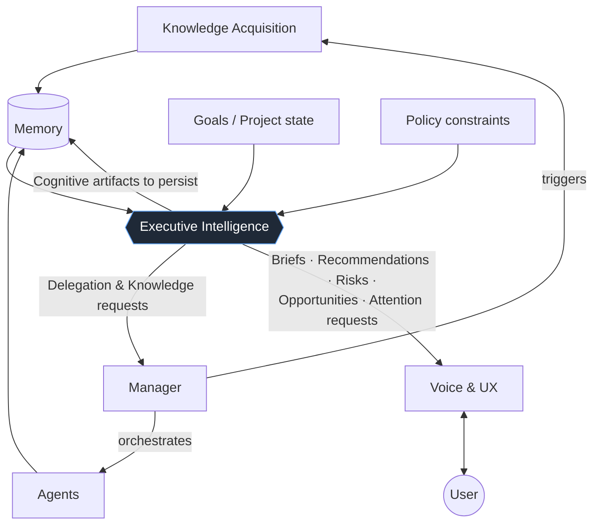
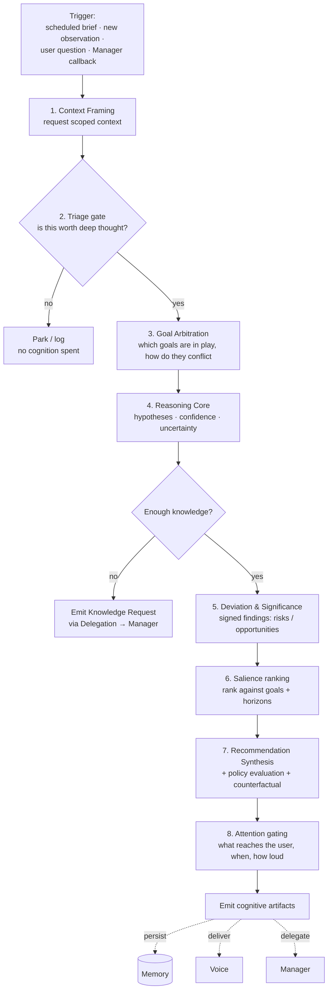
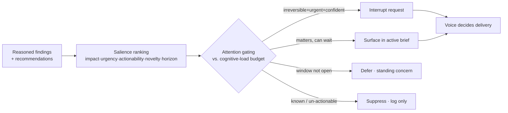
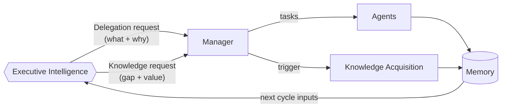

# Atlas Executive Intelligence — Architecture

> **Status:** ATLAS_EXECUTIVE_INTELLIGENCE.md **v1.0 (Canonical)** — frozen. This document is the implementation reference for all future Executive Intelligence development. Changes that break a stated principle are architectural decisions and must be made against this document, not around it.
> **Scope:** The cognitive architecture of the Executive Intelligence layer only.
> **Out of scope:** Memory, Knowledge Acquisition, Retrieval, Collectors, Signals, Intelligence Objects, Manager, Agents, Voice. These are treated as existing capabilities and are *not* redesigned here.
> **Horizon:** This document is written to remain valid as the foundation of Atlas for the next decade. It optimizes for long-term architectural integrity over implementation convenience.

---

## 0. How to read this document

This is a *cognitive* architecture, not a software design. It describes how Atlas thinks, not how it is built. There is deliberately no code, no schema, no API, no service topology. Where those things are implied, they are implied as *consequences* of a cognitive boundary, and the boundary is the thing being specified.

The document also disagrees with parts of its own brief. The brief lists eleven "responsibilities" and a particular ordering of them. Sections 4 and 10 argue that the list contains hidden duplication and a dangerous ordering, and propose a corrected model. That is the point: an architecture meant to last a decade has to survive its own first draft.

---

## 1. Mission and first principles

Executive Intelligence (EI) answers exactly one question:

> **Given everything Atlas already knows, what should happen next?**

Everything in this document is downstream of that sentence. EI transforms knowledge into *executive decision support*. Its product is judgment, not data.

Six first principles govern the entire layer. They are load-bearing; if any is violated, the boundary that makes EI coherent collapses.

**P1 — EI thinks; it does not act, collect, or remember.**
Reasoning is the whole job. The moment EI fetches its own data it has become Knowledge Acquisition. The moment it persists its own state it has become Memory. The moment it does work it has become Manager. Each of these is a *responsibility leak*, and each is individually fatal because it removes the thing that made EI a separable layer in the first place.

**P2 — EI is stateless cognition over stateful inputs.**
EI holds no durable state between reasoning cycles. This is the single most important and most fragile property in the architecture, and Section 3 is devoted entirely to defending it. Every "in-flight" cognitive product — a hypothesis still being tested, a confidence estimate, a standing concern — must be externalized as a *cognitive artifact* that Memory persists, never retained inside EI.

**P3 — Every output is a reasoned artifact, never raw data.**
EI must never emit a fact. It emits *interpretations of facts*: a recommendation, a risk, an opportunity, a brief. If an output could have been produced by Retrieval, EI should not have produced it.

**P4 — Every conclusion carries its reasoning.**
No EI output is valid without a provenance trace: what it was based on, what was assumed, how confident it is, and what would change its mind. This is non-negotiable for three reasons — the user must be able to trust it, Memory must be able to store *why* alongside *what*, and EI must later be able to audit its own track record (Section 8.4).

**P5 — Reducing cognitive load is a first-order goal, equal to correctness.**
An EI that is correct but overwhelming has failed. Attention is the scarcest resource in the system — not compute, not knowledge, but the user's attention. Section 10 treats it as the constrained resource it is.

**P6 — EI never directly invokes external tools, APIs, or services. All external interaction occurs through defined architectural boundaries.**
EI reasons; it does not reach out. It has no client, no connector, no outbound call of its own. Every interaction with the world outside the cognitive layer — acquiring knowledge, executing work, communicating, persisting — happens by emitting a reasoned artifact that a *named* downstream layer consumes (Knowledge via Manager, execution via Manager, communication via Voice, persistence via Memory). This is the operational enforcement of P1: a layer that cannot call anything cannot accidentally become Knowledge Acquisition, Manager, or Voice. If a future feature seems to require EI to call a tool directly, that is a signal the capability belongs in another layer, not that this principle should bend.

---

## 2. The core boundary problem (read before anything else)

The hardest problem in this layer is not reasoning. It is the contradiction baked into P1 and P2: **EI must reason, and reasoning naturally wants to accumulate state, yet EI is forbidden to hold state.**

Consider what "thinking" implies over time. A good executive mind carries forward working hypotheses, refines confidence as evidence arrives, remembers which of its past calls were wrong, and maintains standing concerns it keeps half an eye on. All of that is *durable cognitive state*. A naive EI would keep it internally — and would immediately become a second Memory, in direct competition with the real one. That is the most likely way this architecture rots.

The resolution is a strict rule:

> **EI externalizes all cognition. The reasoning *engine* is stateless; the reasoning *record* lives in Memory.**

Concretely, a hypothesis that must survive until the next cycle does not stay in EI — it is emitted as a cognitive artifact, Memory stores it, and the next cycle receives it back as an input. A confidence calibration history is not held by EI — it is a Memory object EI reads. A standing concern is not an EI variable — it is a persisted artifact re-presented each cycle.

This has a profound and deliberate consequence: **EI is referentially stateless.** Its reasoning depends only on what it is given — the Memory state, goals, observations, and policy passed into the cycle — and on nothing it has secretly retained. This is *not* a claim of deterministic reproducibility. The reasoning substrate is a model and is stochastic; the same inputs may yield differently-worded reasoning on two runs, and chasing bit-for-bit replay is a mistake. The property that matters is narrower and achievable: **no input that shaped a conclusion lives outside the inputs.** Given the recorded inputs and the reasoning trace (P4), any conclusion can be *explained and audited* even if it cannot be byte-identically *reproduced*. That is what lets the layer be tested, audited, versioned, and reasoned about over a decade. The instant EI hides state inside itself, that auditability dies — because a conclusion would then depend on something no one can see.

The dotted lines are the trick. EI's memory *is* Memory. The feedback loop runs through the stateful world, never inside the engine.

---

## 3. Position in the Atlas architecture

EI sits between knowledge and action. It consumes the outputs of the knowledge-side layers and produces decision support that Manager turns into work and Voice turns into communication.

Two boundary facts in this picture are easy to get wrong and are defended later:

1. **EI never calls Knowledge Acquisition directly.** When EI decides it needs more knowledge, it emits a *Knowledge Request* that goes to **Manager**, which orchestrates acquisition. If EI could trigger collectors itself, it would be an orchestrator — Manager's job (Section 12).
2. **EI decides *salience*; Voice decides *delivery*.** EI says "this deserves to interrupt the user." Voice decides whether that becomes a notification, a spoken line, or a line in tomorrow's brief. The boundary is *importance vs. presentation* (Section 10.4).

---

## 4. Reconsidering the responsibilities (adversarial)

The brief enumerates eleven responsibilities: Context Building, Goal Evaluation, Reasoning, Hypothesis Generation, Opportunity Detection, Risk Detection, Prioritization, Attention Filtering, Recommendation Generation, Policy Evaluation, Delegation Requests. Treating these as eleven independent capabilities is a mistake. Several are the same operation; one is not a cognitive capability at all; one is mis-ordered dangerously. The corrected model has **five cognitive operations** plus **two boundary operations**.

**Collapse 1 — Opportunity Detection and Risk Detection are one operation with opposite sign.**
Both are *deviation detection*: a gap between the expected trajectory and a possible one. A risk is a deviation with negative expected utility; an opportunity is a deviation with positive expected utility. Building them as two pipelines guarantees they drift apart, double-scan the same context, and disagree about the same event (a competitor's move is both). They must be a single **Deviation & Significance** operation that emits signed findings (Section 9).

**Collapse 2 — Prioritization and Attention Filtering are two stages of one funnel, but they are *not* the same and must not be merged either.** Prioritization *ranks* what matters to Atlas's goals. Attention Filtering *gates* what reaches the user given their finite attention. Conflating them produces the classic failure: ranking everything by importance and then dumping the ranked list on the user. They are distinct stages of one **Attention** model, and crucially they sit at *opposite ends* of the cycle (Section 10).

**Demotion — Context Building is not a cognitive capability.**
It is input assembly. Listing it as a peer of Reasoning invites the worst responsibility leak in the system: EI growing its own retrieval logic and becoming a shadow Memory. Context Building must be defined *defensively* — as a request for scoped context, answered by Memory/Retrieval — precisely so it never becomes cognition (Section 6).

**Relocation risk — Policy Evaluation straddles the Manager boundary.**
EI must *evaluate* recommendations against policy (a cognitive act: "this action would violate constraint X"). It must never *enforce* policy at execution time (Manager's act). The word "Evaluation" is doing important work and must be held strictly (Section 11).

The corrected decomposition:

| Corrected operation | Absorbs from the original list | Nature |
|---|---|---|
| **Context Framing** | Context Building | Boundary (input) — *not* cognition |
| **Goal Arbitration** | Goal Evaluation | Cognitive |
| **Reasoning Core** | Reasoning, Hypothesis Generation | Cognitive |
| **Deviation & Significance** | Opportunity Detection, Risk Detection | Cognitive |
| **Attention** (two-stage) | Prioritization, Attention Filtering | Cognitive |
| **Recommendation Synthesis** | Recommendation Generation, Policy Evaluation | Cognitive |
| **Delegation** | Delegation Requests, "needs more knowledge" | Boundary (output) |

Eleven becomes seven, with the duplication removed and the two boundary operations clearly marked as the places where leaks happen.

> **These seven are conceptual capabilities, not implementation modules.** They name *aspects of a single cognitive act* — the cycle of Section 5 — not seven services with interfaces between them, not seven stages in a build, not seven boxes on a deployment diagram. The table is a way to think about what EI does, not a manifest of what to build. Implementing the seven as separately-deployed, independently-interfaced units would re-introduce exactly the rigid pipeline this document rejects in Section 5, and would manufacture coupling (and serialization points) where the architecture intends one continuous, iterative reasoning pass. Treat the boundaries *between* these operations as soft and internal; treat only the boundaries with Memory, Manager, Knowledge Acquisition, and Voice as hard.

---

## 5. The cognitive cycle

EI does not run as a fixed pipeline. A rigid pipeline (`Context → Goals → Reason → … → Output`) is wrong for two reasons: reasoning is iterative (a hypothesis may demand more context mid-thought), and expensive reasoning must not be spent on things that will be filtered out at the end. EI runs as a **bounded cognitive cycle** with an early triage gate.

The **triage gate (step 2)** is the single most important ordering decision in the architecture and the place the brief got wrong. The brief lists Attention Filtering *ninth*, after reasoning. If attention is only applied at the end, EI must reason deeply about everything and then discard most of it — which does not scale past a trivial knowledge volume and burns the reasoning budget on noise. The fix is a **two-stage attention model**: a cheap triage gate *before* expensive reasoning ("is this even worth thinking about?"), and an expensive salience ranking *after* reasoning ("now that I understand it, how much does it matter and should the user see it?"). Cheap filtering up front; precise filtering at the end.

The loop back from **NEEDK** (step 4) is what makes this a cycle rather than a pipeline. When reasoning discovers that it cannot reach adequate confidence without more knowledge, it does not guess and it does not fetch — it emits a Knowledge Request and either suspends or proceeds with explicit uncertainty (Section 8.5).

---

## 6. Context Framing — defended against the retrieval leak

Context Framing answers: *what does EI need to be looking at to reason about this trigger?* It is deliberately the thinnest operation in the layer, because it is the most dangerous.

The danger: "building context" sounds like cognition, so a designer naturally gives EI logic to decide *what to fetch and how to rank it*. That logic is retrieval. Once EI has it, EI has quietly forked Memory's retrieval into a second, divergent implementation — and now there are two systems deciding what's relevant, guaranteed to disagree over a decade.

The rule that prevents this:

> **EI states the *shape* of context it needs; Memory/Retrieval decides *what fills it*. EI never ranks, scores, or selects raw knowledge.**

EI's request is intent-level: "the current state of project X, its goals, recent deviations, and the last decisions I made about it." How that resolves into specific knowledge is entirely Memory's concern. EI receives *structured knowledge* (already an existing input) and reasons over it. If EI ever finds itself comparing two raw facts to decide which is more relevant *before* reasoning, the boundary has been breached.

A second discipline: **context is scoped, not a firehose.** At decade scale, total knowledge is enormous; EI cannot receive all of it and must not try. Context Framing names a bounded scope per trigger. This keeps EI's cognition tractable and keeps the coupling to Memory at the level of *intent* rather than *volume* — which is the coupling that survives growth.

---

## 7. Goal Arbitration

The brief says "Goal Evaluation." Evaluation undersells it. In any real executive context, goals *conflict*: growth vs. stability, this tenant vs. that tenant, the urgent quarterly number vs. the slow strategic bet. The hard cognitive act is not evaluating one goal — it is **arbitrating among competitors**.

Goal Arbitration does three things:

1. **Determines which goals are in play** for the current trigger and scope. Most goals are irrelevant to most triggers; surfacing the relevant few is itself reasoning.
2. **Surfaces conflicts** between in-play goals and makes the trade-off *explicit* rather than silently resolving it. An EI that silently picks growth over stability is making a values decision it has no authority to make. It must instead say "these conflict; here is the trade-off."
3. **Applies goal hierarchy across time horizons.** This is a missing concept in the brief. Executive reasoning is inherently multi-horizon — now / this week / this quarter / this year. A single priority scale that ignores horizon will *always* starve long-term goals, because near-term items are reliably more urgent. Atlas must reason about each horizon as a separate arena and protect the long horizon from being perpetually outcompeted by the short one (Section 10.2 makes this concrete in ranking).

Goals themselves are an existing input and are not designed here. What is designed is that EI treats them as a *contested hierarchy across horizons*, not a flat checklist.

---

## 8. Reasoning Core

This is the heart of the layer: turning framed context and arbitrated goals into hypotheses, judgments, and confidence.

### 8.1 Hypotheses as first-class, disposable objects

EI reasons by forming **hypotheses** — candidate explanations or candidate futures — and testing them against available knowledge. A hypothesis is explicit: a claim, the evidence for and against it, the assumptions it rests on, and a confidence. Most hypotheses are formed and discarded within a single cycle and never leave EI. A hypothesis only becomes a persisted artifact when it must survive to the next cycle (e.g., "I suspect tenant churn is rising; I need another week of data to confirm") — at which point it is externalized to Memory per the P2 rule, not retained.

Making hypotheses explicit objects (rather than implicit chains of thought) is what makes EI's reasoning auditable and what lets a later cycle pick up a prior line of thought without EI holding state.

### 8.2 Confidence as a calibrated quantity, not a vibe

Every judgment carries a confidence. But a confidence number is worthless unless it is *calibrated* — unless "70% confident" actually corresponds to being right about 70% of the time. The brief says "validate confidence" but does not say against what. The answer:

> **EI's confidence is calibrated against its own outcome history, which lives in Memory.**

This requires the **decision ledger** (Section 8.4): a persisted record of what EI predicted/recommended and what actually happened. EI reads its calibration history as an input and reasons over it afresh each cycle — it does *not* retain a learned correction factor between cycles (that would be hidden state, violating P2). "Calibration" here is per-cycle reasoning over a read-only history, not a tuned parameter living inside EI. Without this loop, confidence drifts into self-flattery over years. With it, EI gets measurably better at knowing what it knows. This is one of the most important decade-scale properties in the whole design and it is entirely absent from the original brief. (Note the practical limit in Section 16, R5: for rare-but-important decisions the history may stay too thin to calibrate well, so calibration is a best-effort signal, never a guarantee.)

### 8.3 Explaining recommendations

Per P4, every conclusion carries its reasoning trace. The explanation is not a courtesy — it is part of the artifact. A recommendation's trace answers: what did I observe, which goals it serves, what I assumed, what alternatives I considered (including doing nothing — Section 11.2), how confident I am, and **what would change my mind**. That last element, the *defeater*, is what separates executive reasoning from assertion: a recommendation that cannot state what would falsify it has not been reasoned, only emitted.

### 8.4 The decision ledger (missing concept, made first-class)

Recommendations have a lifecycle: *proposed → accepted / rejected / deferred → outcome observed*. EI must be able to reason over its own track record — which kinds of calls it gets right, where it is systematically over- or under-confident, which recommendations the user always rejects (a strong signal its model of the user is wrong).

The ledger is a **Memory** object, not an EI object — consistent with P2. EI reads it back as an input each cycle. But the ledger has three fields with three different owners, and naming them is essential or the feedback loop has a silent hole:

- **The prediction/recommendation** (what EI expected or proposed) is authored by **EI**, emitted as a cognitive artifact, and persisted by **Memory**.
- **The disposition** (accepted / rejected / deferred) is authored by whoever decides — the **user via Voice**, or **Manager** under standing delegated authority — and persisted by **Memory**.
- **The outcome** (what actually happened in the world) is the field EI *cannot* author, because observing the world would violate P1/P6. The outcome is reported by **Manager** when the delegated work completes (or surfaced by **Knowledge Acquisition** as an observation) and recorded by **Memory** against the original ledger entry.

EI never closes its own loop; it reads a loop that Manager, Voice, and Knowledge Acquisition close *for* it through Memory. This is the precise mechanism that lets a reasoning system improve over a decade without a human re-tuning it. An EI with no memory of its own past decisions is condemned to repeat the same misjudgments forever — but an EI that tried to record outcomes itself would have quietly become an observer of the world, which it must never be.

### 8.5 Reasoning under incomplete information

EI will *usually* reason with incomplete information; this is the normal case, not the exception. Three disciplines:

- **Make the gap explicit.** Uncertainty is named, not hidden. "I don't know X, and it matters this much" is a valid and frequent output.
- **Decide whether the gap is worth closing.** Not every unknown justifies acquisition. If the missing knowledge would not change the recommendation, EI proceeds and says so. If it *would* change it, EI weighs the cost of acquisition against the value of the improved decision — and only then emits a Knowledge Request (Section 12).
- **Recommend reversibly under uncertainty.** When confidence is low, EI should prefer recommending *reversible, information-gathering* actions over *irreversible, committing* ones. Uncertainty should bias toward options that preserve future choices. This single heuristic prevents a large class of confident-but-wrong failures.

---

## 9. Deviation & Significance (risk and opportunity unified)

Per Collapse 1, risk and opportunity are one operation. Deviation & Significance compares the *expected trajectory* (what Atlas believed would happen) against *observed and possible trajectories*, and emits **signed significance findings**:

- A **risk** is a deviation with negative expected utility against an in-play goal.
- An **opportunity** is a deviation with positive expected utility against an in-play goal.

Unifying them is not just deduplication — it is more correct. The same event is frequently both (a market shift threatens one goal and opens another), and only a unified operation will report both faces of it. Two separate detectors would each see half.

A finding carries: the deviation (expected vs. actual), the goal(s) affected, the sign and magnitude of expected utility, the confidence, and the time horizon on which it bites. Magnitude × confidence × horizon-weight feeds directly into salience ranking (Section 10.2). Findings are *interpretations*, never raw events — per P3, EI does not report "competitor launched X"; it reports "competitor's launch threatens our retention goal over the next quarter, moderate confidence."

---

## 10. Attention — the constrained-resource model

Attention is where this architecture earns its keep, because P5 makes cognitive load a first-order goal. The model has two stages at opposite ends of the cycle and one hard boundary with Voice.

### 10.1 Two stages, two questions

- **Triage gate (early, cheap):** *Is this worth thinking about at all?* Applied before expensive reasoning. Cheap, high-recall, deliberately permissive — it only discards the obviously irrelevant. Its job is to protect the reasoning budget, not to decide what the user sees.
- **Salience ranking + attention gating (late, expensive):** *Now that I understand this, how much does it matter, and should the user see it — when, and how loudly?* Applied after reasoning, when EI actually understands significance.

Merging these is the canonical failure (Section 4). Keeping them apart is what lets EI think hard about a few things and stay silent about most.

### 10.2 The ranking axes

Salience is not a single "importance" score. It is a function of several axes, and collapsing them loses information the user needs:

- **Impact** — magnitude of expected utility on in-play goals.
- **Urgency** — how fast the decision window closes.
- **Actionability** — is there anything the user could actually do? High-impact but un-actionable items inform; they do not demand attention.
- **Novelty** — is this new, or already known/already surfaced? Re-surfacing known items is a primary cause of overload.
- **Horizon weight** — a deliberate up-weighting of long-horizon items to counteract the structural starvation described in Section 7. Without this, the urgent permanently buries the important.

### 10.3 The four attention decisions

The brief's four questions map cleanly onto thresholds over the axes above:

- **Interrupt immediately** — reserved and rare. Justified only when *irreversibility* + *closing time-window* + *high confidence* + *high impact* coincide. Interrupting is the most expensive thing EI can ask for; the bar is deliberately high.
- **Surface now (non-interrupting)** — matters and is actionable, but can wait for the user to look. Goes into the active brief / queue.
- **Defer** — matters but the decision window is not yet open, or more knowledge is pending. Held as a standing concern (a persisted artifact) and re-evaluated next cycle.
- **Suppress** — known, un-actionable, or below significance. Logged for provenance (so EI can later show *why* it stayed silent) but not surfaced.

A standing **cognitive-load budget** governs the whole stage: there is a finite amount of user attention per period, and salience competes for it. When the budget is full, only items that beat the current marginal item get through. This is what makes "never overload the user" an enforced constraint rather than an aspiration.

**Ownership of the budget — explicit, because it is easy to leak.** The budget is *not* state that EI holds, and EI does *not* observe the user to compute it. Both would breach P2 (retained state) and P1/P6 (observing the world). Instead:

- The budget's **consumption** — what has already been surfaced to the user this period — is read from **Memory** as an input each cycle. EI derives "how much room is left" by reasoning over that input, then discards the derivation. It carries nothing forward.
- The budget's **signals** — dismissals, engagement, whether the user is overwhelmed or idle — are **observed by Voice/UX**, written to **Memory**, and arrive to EI as inputs. EI never watches the user directly; it reasons over what Voice recorded.
- The budget's **size** — how much attention this user has, per period — is a tenant/user configuration and a slow-moving input, not an EI-owned value.

So EI *applies* the budget as a constraint during gating; it does not *own*, *measure*, or *persist* it. The budget lives in the stateful world (Memory + Voice + config); EI only reasons against it. This keeps the attention model from quietly turning EI into a stateful observer of the user.

### 10.4 The Voice boundary

EI decides *salience and posture* — "this is interrupt-worthy," "this is FYI." EI does **not** decide *delivery* — whether that becomes a push notification, a spoken sentence, or a brief line. Delivery is Voice's domain, because delivery depends on channel, device, user presence, and modality, none of which are EI's concern. The artifact EI emits carries an **attention request** (a salience level and rationale); Voice renders it. Crossing this line would couple EI to presentation and make it un-reusable across surfaces over a decade.

---

## 11. Recommendation Synthesis

This is where reasoning becomes an executive product. A recommendation is a *decision-ready* unit: a proposed course of action, the case for it, its trade-offs, its confidence, and what it would take to be wrong.

### 11.1 Policy evaluation (cognitive, not enforcement)

Before a recommendation is emitted, EI evaluates it against **policy constraints** (an existing input). This is a cognitive act — "this action would violate constraint X, so I will not recommend it, or I will recommend it flagged." It is emphatically **not** runtime enforcement; Manager enforces policy at execution. Holding this line matters because the two could easily blur into "EI gatekeeps execution," which would make EI a control-plane component and destroy the reason/execute separation. EI's policy role is to *not propose* things that violate policy and to *explain* when a desirable action is policy-blocked.

### 11.2 The counterfactual baseline (missing concept)

> **Every recommendation competes against doing nothing.**

The brief never mentions inaction. This is a serious omission: an EI that only ever generates *actions* will manufacture work, because its whole frame is "what should happen next." The corrective is a mandatory **"do nothing" baseline** — every recommendation must beat the expected utility of inaction to be emitted at all. Often the correct executive output is "no action needed; here's why," and an architecture that cannot produce that output will steadily increase the user's load rather than reduce it, violating P5. The counterfactual is the structural defense against an over-eager Atlas.

### 11.3 Recommendation, not command — and EI does not wait in the loop

EI recommends; the user (or Manager under delegated authority) decides. Even a high-confidence recommendation is a proposal with a rationale and a defeater. This preserves human agency and keeps EI honest, because every recommendation's outcome flows back into the decision ledger (Section 8.4) and re-calibrates future confidence.

One subtlety that must be nailed down or it leaks: **EI does not block, wait, or hold a control loop pending acceptance.** A recommendation is *not* a request that EI then watches for a yes/no in order to fire a follow-up. Waiting on acceptance would mean EI is holding cross-event state and sitting in the execution control loop — a P2 and P6 violation. Instead, EI emits a recommendation **with a proposed delegation already attached** (the "if accepted, here is the work to delegate" is part of the same artifact). The accept→execute transition then belongs entirely to **Voice** (surfacing the choice and capturing the user's decision) and **Manager** (executing on acceptance). EI's involvement ends when the artifact is emitted; it re-enters only on the *next cycle*, when the disposition and eventual outcome arrive back as inputs through Memory (Section 8.4). EI proposes and moves on; it never stands and waits.

---

## 12. Delegation — the Manager and Knowledge boundaries

EI produces two kinds of outbound requests, and both go to **Manager**. EI orchestrates nothing itself.

**Delegation Requests (execution).** A delegation request describes *what outcome is wanted and why* — never *how to do it*. As established in Section 11.3, EI attaches the proposed delegation to the recommendation rather than waiting for acceptance and then firing it; on acceptance, Manager decomposes it into tasks and assigns Agents. The "what/why vs. how" line is the reason/execute boundary; if EI ever specifies the execution plan, it has absorbed Manager.

**Knowledge Requests (acquisition).** When reasoning hits a gap worth closing (Section 8.5), EI emits a knowledge request — "I need current data on X to raise confidence on decision Y." This also goes to **Manager**, which triggers Knowledge Acquisition. EI does **not** call collectors or Knowledge Acquisition directly (this is P6 in action).

Every knowledge request carries a **gap classification** that EI is uniquely positioned to assign, because only EI knows the state of its own reasoning:

- **Blocking** — reasoning is *suspended* on this gap; EI cannot reach an adequate conclusion without it. The cycle either parks the line of thought or proceeds only with explicit, loudly-flagged uncertainty.
- **Enriching** — the gap would *improve a future decision* but is not stopping the current one. Reasoning continues to a usable conclusion now; the knowledge would sharpen later cycles.

This classification is a *property of the request artifact*, not a routing instruction — it does not let EI bypass anyone. Its purpose is to give Manager the information to run a **priority lane for blocking gaps** without EI needing a second channel. It is the one refinement that neutralizes the latency objection to routing-through-Manager (see below) while leaving the orchestration boundary exactly where it is.

**Why Manager remains the single orchestration boundary (decision reviewed and kept).** This routing was deliberately challenged. Acquisition is *work* — it has real, unbounded cost (compute, rate limits, money) and must be prioritized against everything else Atlas does. A reasoning engine will always want "a little more context," so something must arbitrate that spend against all other work; that arbiter is Manager. The considered alternative — EI calling Knowledge Acquisition directly — is the one genuinely unsafe option: it would give EI a second channel to commit resources with no arbiter, recreating the dual-orchestrator problem the whole architecture exists to avoid, and breaking P6. The real cost of routing through Manager is latency on *blocking* gaps, and that is fully addressed by the blocking/enriching lane above rather than by a bypass. Manager stays the single throat to choke for "what work is Atlas doing"; EI gains a way to say "this particular gap is stopping me," which is cognition, not orchestration.

The loop closes through Memory, never directly back to EI — preserving statelessness (P2).

---

## 13. Executive Briefing

The brief's instruction is exact and worth repeating: *the objective is not summarization; it is executive awareness.* A summary tells the user what happened. A brief tells the user **what it means and what they should do about it.** A brief that lists events is a failed brief — that is Retrieval's output, not EI's (P3).

### 13.1 The shape of every brief

Regardless of type, an executive brief has the same cognitive shape:

1. **Situation** — the current state in one reasoned sentence, not a list.
2. **What changed** — only the deviations that matter (from Section 9), not all activity.
3. **What it means** — EI's interpretation: implications for goals.
4. **What I recommend** — decision-ready recommendations, each beating the do-nothing baseline.
5. **What needs you** — the (short) list of things actually requiring the user's attention or decision, gated by Section 10.

The discipline is subtractive: a good brief is mostly things *left out*. The cognitive-load budget applies here directly — a brief is the primary surface where overload happens.

### 13.2 The five briefs as horizons and decision-questions

The five brief types are not five formats. They are five **time horizons**, each answering a different executive question:

| Brief | Horizon | Decision question it answers |
|---|---|---|
| **Morning** | Today | "What deserves my attention today, and what should I decide first?" |
| **Evening** | Today, retrospective | "What changed today that I should know, and what's set up for tomorrow?" |
| **Weekly** | This week / next | "Are we on track against this week's goals; what needs to shift?" |
| **Project** | One project, current | "What is the real state of this project, what's at risk, what's the next decision?" |
| **Strategic** | Quarter / year+ | "Are we still pointed at the right things; what long-horizon signals are forming?" |

The Strategic brief is the one most likely to be neglected and the most important to protect, for the same reason long horizons get starved in ranking (Section 7). It is also the brief where EI's value is highest, because long-horizon synthesis is exactly what humans are worst at and most need offloaded. Horizon-weighting (Section 10.2) is what keeps the Strategic brief from being perpetually crowded out by today's noise.

### 13.3 Briefs are cognitive artifacts, not transient text

A brief is reasoned content that Voice renders for delivery (Section 10.4) and that Memory persists. Persistence matters: tomorrow's brief should know what yesterday's said, so EI can say "the risk I flagged Monday has materialized" — which it does by reading prior briefs back as input, not by remembering them (P2).

---

## 14. Outputs as cognitive artifacts

Every EI output is a *cognitive artifact*: a reasoned object carrying its provenance (P4). The full set:

- **Executive Briefs** (Section 13)
- **Recommendations** — decision-ready, with trade-offs, confidence, defeater, and counterfactual
- **Prioritized actions** — ranked recommendations for a scope
- **Attention requests** — salience level + rationale, for Voice to deliver
- **Strategic observations** — long-horizon interpretations not yet actionable
- **Risks** and **Opportunities** — signed significance findings (Section 9)
- **Delegation requests** (proposed delegation attached to a recommendation) and **Knowledge requests** (tagged *blocking* or *enriching*) — for Manager (Section 12)
- **Hypotheses** (when externalized) and **decision-ledger entries** (EI authors only the prediction field; disposition and outcome are authored elsewhere, Section 8.4) — for Memory

Every one of these is consumed by exactly one of three downstream layers — **Memory** (persist), **Voice** (communicate), **Manager** (execute) — and EI consumes none of its own outputs except by reading them back through Memory next cycle. That single sentence is the integrity test for the whole layer: if any EI output is consumed by EI directly, statelessness is broken.

---

## 15. Multi-tenant and decade-scale considerations

Omnira is multi-tenant (Driver The Prompt, GainPilot, Familje-Stunden, and future tenants). EI's cognition must be **tenant-isolated in content but shared in mechanism**:

- The **reasoning engine, cognitive cycle, attention model, and brief shapes are shared** across tenants. They are the product.
- **Goals, policy, calibration history, decision ledgers, and standing concerns are strictly per-tenant** and arrive as inputs. The most dangerous decade-scale leak is tenant context bleeding across the shared engine — one tenant's priorities subtly coloring another's reasoning. Because EI is stateless (P2), this is *structurally* prevented: with no retained state, there is nothing to bleed; each cycle reasons only over the inputs it was given for one tenant. This is a second major payoff of statelessness, beyond auditability.

Scaling pressures over a decade and how the architecture absorbs them:

- **Knowledge volume grows without bound** → absorbed by scoped Context Framing (Section 6); EI never receives the firehose, so its cognition cost scales with *scope*, not with total knowledge.
- **Reasoning cost grows** → absorbed by the early triage gate (Section 5); deep reasoning is spent only on what passes triage.
- **User attention does not grow** → absorbed by the cognitive-load budget (Section 10.3); the constraint is enforced, not hoped for.
- **The reasoning substrate (models) will change repeatedly** → EI is specified as cognitive *behavior and boundaries*, not as a particular model. Swapping the underlying model is an implementation event, not an architectural one, precisely because this document defines no implementation. That is why it can last a decade.

---

## 16. Architectural risks and failure modes (the adversarial core)

These are the ways this architecture most plausibly fails over ten years, with the defense for each. This section is the point of the document.

**R1 — EI grows a memory.**
*Failure:* working state creeps into EI "for efficiency," and EI becomes a second, divergent Memory. *Defense:* P2 + referential statelessness (Section 2). The test: if any conclusion depends on something not present in EI's inputs, the boundary is already broken. Audit the input-dependency of conclusions, not intentions.

**R2 — Context Framing becomes retrieval.**
*Failure:* EI starts ranking and selecting raw knowledge; two retrieval systems now disagree. *Defense:* EI states context *shape*, never selects raw facts (Section 6). The test: does EI ever compare two raw facts for relevance before reasoning? If yes, it has absorbed Retrieval.

**R3 — EI starts orchestrating.**
*Failure:* EI triggers collectors or specifies execution plans "to be helpful," absorbing Manager. *Defense:* all outbound work routes through Manager as what/why requests (Section 12). The test: does any EI output specify *how* rather than *what*?

**R4 — Attention applied too late.**
*Failure:* the brief's original ordering — reason about everything, filter at the end — caps scale and burns budget. *Defense:* two-stage attention with an early triage gate (Sections 5, 10). This is the fix this document insists on most strongly.

**R5 — Confidence theatre.**
*Failure:* confidence numbers that are never checked against outcomes drift into self-flattery; the user learns to ignore them. *Defense:* the decision ledger + calibration loop (Sections 8.2, 8.4). Uncalibrated confidence is worse than none. *Known limit:* for rare-but-important decisions the outcome history may stay permanently too thin to calibrate; calibration is therefore a best-effort signal, never a guarantee, and the architecture must not lean on it as if it will always converge.

**R6 — Manufactured work.**
*Failure:* an action-framed EI generates recommendations to justify itself, increasing load and violating P5. *Defense:* the mandatory do-nothing counterfactual (Section 11.2). "No action needed" must be a first-class output.

**R7 — Long horizon starvation.**
*Failure:* urgent near-term items permanently outrank important long-term ones; the Strategic brief withers. *Defense:* multi-horizon arbitration + horizon-weighting (Sections 7, 10.2, 13.2).

**R8 — The EI/Voice boundary blurs.**
*Failure:* EI starts deciding delivery (notifications, phrasing), coupling cognition to presentation and breaking reuse across surfaces. *Defense:* EI emits salience + rationale; Voice owns delivery (Section 10.4).

**R9 — Provenance erosion.**
*Failure:* under volume pressure, traces get dropped "to save space," and outputs become unauditable and untrustworthy. *Defense:* P4 makes the trace part of the artifact, not an add-on. An output without a trace is malformed, not merely terse.

**R10 — Goal silently overridden.**
*Failure:* EI resolves a goal conflict by quietly choosing a side, making a values decision it has no mandate for. *Defense:* Goal Arbitration surfaces conflicts as explicit trade-offs rather than resolving them invisibly (Section 7).

---

## 17. Open questions

Genuine unknowns to resolve before or during implementation. None are settled here.

1. **Trigger authority.** What is allowed to wake EI — only scheduled briefs and user questions, or also Memory/Manager events? An overly reactive EI re-reasons constantly and floods downstream layers; an under-reactive one misses time-critical deviations. Where is the line?
2. **Calibration cold-start.** The decision ledger needs outcome history to calibrate confidence, but early on there is none. How does EI behave before it has a track record without either false confidence or paralysis?
3. **Conflicting cognitive artifacts.** When a freshly reasoned finding contradicts a persisted standing concern, which wins, and how is the contradiction reconciled without EI holding arbitration state?
4. **Cross-tenant strategic synthesis.** Is there *ever* a legitimate case for reasoning across tenants (e.g., a pattern Atlas sees in one tenant that would help another)? If so it violates strict isolation (Section 15); if never, Atlas forfeits a real source of insight. This needs an explicit, deliberate ruling.
5. **The cognitive-load budget's calibration.** How is "how much attention the user has" determined and adapted — fixed, learned from engagement, or user-set? Get this wrong and either overload (P5 violated) or under-serve.
6. **Recommendation authority gradient.** Some recommendations the user must approve; some Manager may execute under standing delegated authority. Who sets that gradient, and does EI reason about *where on it* a given recommendation falls, or is that purely policy?
7. **Interrupt-fatigue feedback.** If the user dismisses interrupts, EI should learn to raise its bar — but that learning loop runs through the decision ledger and risks EI becoming *too* quiet about genuinely urgent things. How is that loop damped?

---

## 18. Principles (the standard this layer is held to)

- EI **reasons**. Manager **executes**. Memory **remembers**. Knowledge Acquisition **acquires**. Voice **communicates**. These do not overlap.
- EI is **stateless cognition over stateful inputs** — *referentially* stateless: every conclusion depends only on what it is given, even though the stochastic substrate makes it auditable rather than byte-reproducible.
- EI **never invokes external tools, APIs, or services directly** — all external interaction passes through a defined architectural boundary (P6).
- EI emits **reasoned artifacts, never raw data**, each carrying its **provenance and its defeater**.
- Every recommendation **competes against doing nothing**.
- **Attention is the scarce resource.** Filter cheaply early, precisely late, and never overload the user.
- EI **surfaces conflicts and uncertainty** rather than hiding them, and **protects the long horizon** from the urgent.
- EI **improves by remembering its own track record** — through Memory, never within itself.

If a future change to Atlas requires breaking one of these, that is not a feature decision — it is an architectural decision, and it belongs back in this document.

---

## 19. Version history

**v1.0 (Canonical) — frozen.** Promoted from Draft v1 after a long-term-maintainability review. Changes folded in at freeze, all clarifications of existing structure rather than new scope or new components:

1. **Statelessness de-overclaimed** (Section 2, P2, Section 16/R5, Section 18) — "pure function / replayable" replaced with *referential statelessness*: conclusions depend only on inputs and are *auditable*, not byte-reproducible, because the substrate is stochastic.
2. **Decision-ledger ownership specified** (Section 8.4) — three fields, three owners: EI authors the prediction; Voice/Manager author the disposition; Manager (or Knowledge Acquisition) reports the outcome; Memory persists all three. EI never records outcomes itself.
3. **Cognitive-load budget ownership specified** (Section 10.3) — the budget lives in the stateful world (Memory consumption + Voice-observed signals + per-user config); EI applies it as a constraint but never owns, measures, persists, or observes it.
4. **Seven cognitive operations marked conceptual** (Section 4) — explicit warning that they are facets of one reasoning cycle, not implementation modules/services/stages.
5. **Recommendation/delegation clarified** (Sections 11.3, 12) — EI attaches a proposed delegation to the recommendation and moves on; it never blocks or holds a control loop waiting for acceptance. Accept→execute belongs to Voice + Manager.
6. **Blocking vs. enriching knowledge-gap classification added** (Section 12) — every knowledge request is tagged by EI; Manager remains the single orchestration boundary and runs a priority lane for blocking gaps. EI→Knowledge-Acquisition-direct was considered and rejected.
7. **New principle P6 added** (Section 1) — EI never directly invokes external tools, APIs, or services; all external interaction occurs through defined architectural boundaries.

This version is the implementation reference. Subsequent changes are tracked here and must preserve the principles in Section 18 or be raised explicitly as architectural decisions.
